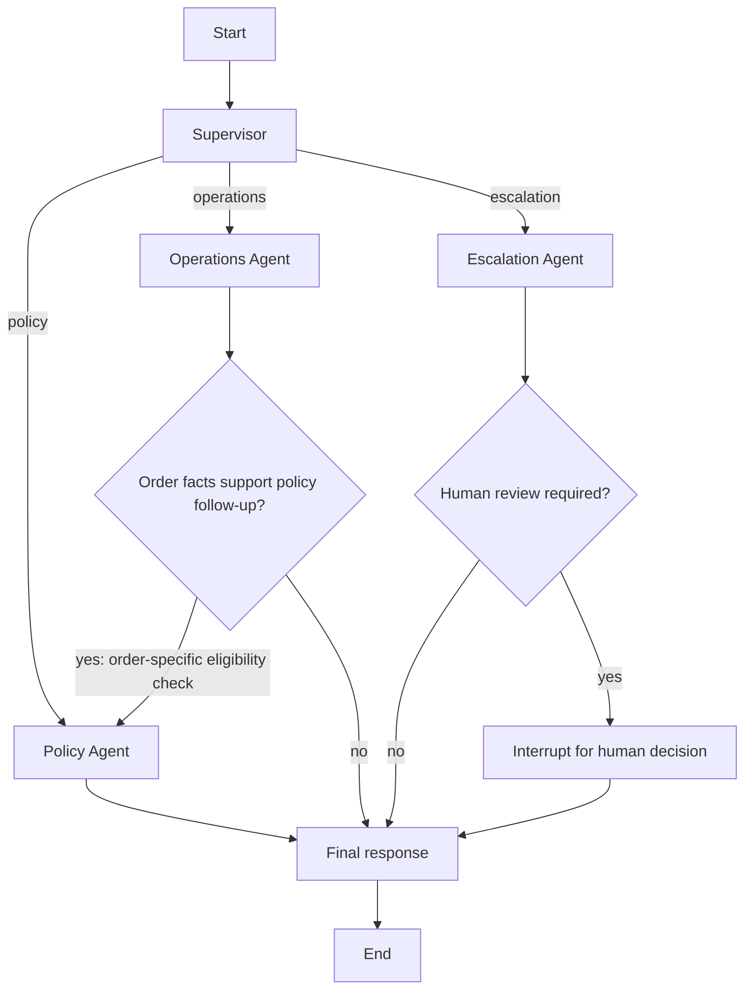

# Architecture

## Purpose and system boundary

This project implements a single-request customer-support workflow with LangGraph. It routes a customer message to a specialist, optionally pauses for a human decision, and renders a response from structured results. Policy retrieval and order lookup are separate data paths: policy text is embedded and searched with Chroma, while order facts come from parameterized SQLite queries.

The current executable boundary is `main.py`, an interactive CLI. There is no HTTP service, user identity/authentication layer, production integration, or write operation against orders. Sample policies and orders are illustrative. Treat all decisions as workflow demonstrations rather than authoritative business actions.

## Components and responsibilities

| Component | Responsibility | Inputs and outputs |
|---|---|---|
| CLI (`main.py`) | Checks API-key presence, indexes policies, starts the persistent graph, collects a request and any interrupt response | Creates initial state and a unique `thread_id`; prints `final_response` |
| Supervisor (`agents/supervisor.py`) | Chooses exactly one specialist route | Uses deterministic intent/risk rules first; uses structured chat classification for ambiguous requests; routes uncertain classifier failures to escalation |
| Policy Agent (`agents/policy.py`) | Assesses a request against retrieved rules and optional verified order facts | Emits `PolicyResult`; returns a safe insufficient-information result if the request or retrieved context is empty |
| Policy knowledge base (`policy_knowledge_base.py`) | Loads `policies.md`, splits on Markdown headings, then bounds oversized sections | Produces `Document` chunks with source and heading metadata |
| Policy retrieval (`policy_retrieval.py`) | Embeds chunks and manages similarity search | Uses OpenAI `text-embedding-3-small` and persistent Chroma by default; returns up to four relevant chunks by default |
| Operations Agent (`agents/operations.py`) | Selects and runs order lookup tools | Uses chat tool calling; maps structured tool results to `OperationsResult`, not arbitrary model prose |
| SQLite/tools (`order_database.py`, `operations_tools.py`) | Stores and reads sample order facts | Tools validate numeric IDs and return structured success/error data; no mutation tool exists |
| Escalation Agent (`agents/escalation.py`) | Determines whether human review is needed and assigns reason/priority | Structured chat assessment with deterministic risk signals that override a model false negative; records a decision but does not interrupt itself |
| Human approval (`hitl_escalation.py`) | Pauses execution when `required` is true and validates a resume payload | Records `HumanDecision` as `approved` or `rejected` with an optional note |
| Response renderer (`response_generation.py`) | Creates concise customer-facing text from the selected specialist result | Deterministic formatting; does not make policy/order decisions or add new facts |
| Main graph (`graph.py`) | Connects agents, conditional edges, final response, and checkpointing | Compiles an injectable workflow; provides both in-memory and context-managed SQLite checkpoint options |

## Main graph

The Supervisor route is the sole initial dispatch value. It applies explicit rules for policy topics, order lookups, order-specific eligibility questions, and escalation signals. Order-specific return/exchange eligibility routes to Operations first. Once order details with a purchase date are available, `_policy_follow_up_required` in `graph.py` checks the original request and routes to Policy if it is an eligibility question. Ordinary status and policy requests do not take this extra path.

An escalation route is not synonymous with a human pause. The Escalation Agent may return `required: false`; only `required: true` leads to `human_approval`. The interrupt includes the request, reason, priority, and allowed decisions. `interrupt()` suspends the node; resuming with a validated decision completes the node and continues to response rendering.

## Request lifecycle

1. The CLI constructs a new state with the request ID/text and nullable result fields, then invokes the graph using `configurable.thread_id`.
2. The Supervisor returns `route` and an internal `route_reason`. Clear intent signals are handled with deterministic rules. Ambiguous requests are classified with structured output from the configured chat model; if classification raises, the route falls back to escalation for review.
3. The selected specialist returns a typed result in shared state.
4. For order-specific return/exchange eligibility, Operations retrieves the order date and status. Policy receives those verified facts along with retrieved policy chunks. It computes elapsed calendar days from the purchase date at runtime and asks the structured model to assess the return window and final-sale rules. The workflow does not treat the model as the source of the store's policy; retrieved text is supplied as its policy basis.
5. If escalation is required, the graph interrupts and the CLI collects `approved` or `rejected` plus an optional note. The same thread ID is used to resume.
6. The renderer chooses the appropriate result by the Supervisor's route and writes `final_response`. For an operations route with a policy follow-up result, it uses the policy summary. For escalation, it describes the human decision without claiming the underlying request was fulfilled.

## Shared state contract

`CustomerSupportState` in `state.py` defines the cross-node contract:

| Field | Meaning |
|---|---|
| `request_id`, `request_text` | Request identity and original customer input |
| `messages` | LangGraph message list using the `add_messages` reducer |
| `order_id`, `intent`, `customer_sentiment` | Optional request context supplied to agents |
| `policy_result` | Decision, summary, final-sale fact, return window, and eligibility |
| `operations_result` | Outcome, summary, order status, and purchase date |
| `escalation_result` | Whether escalation is required, reason, and priority |
| `human_decision` | Validated `approved`/`rejected` result and optional note |
| `final_response` | Deterministically rendered response string |
| `errors` | Additive structured error list contract |

The graph extends this state with `route` and `route_reason`. `messages` and `errors` have reducers for merge behavior. In the current implementation, agents do not append to `messages` or `errors`; most handled failures are represented in the relevant specialist result (`outcome`, `decision`, or escalation result). Avoid interpreting these declared fields as a complete audit/event log.

Specialist result shapes are declared as `TypedDict`s. The model-facing results for Policy, Supervisor, and Escalation are validated with Pydantic structured-output schemas before they are placed in state. Operations results are mapped from structured tool outputs.

## Policy retrieval and freshness

`load_policy_chunks()` loads the local Markdown policy document. It first splits at `#`, `##`, and `###` headings and then recursively splits long sections at 800 characters with 100-character overlap. Source and heading metadata are retained for context labels. `index_policy_knowledge_base()` embeds each chunk and adds it to the `customer_support_policies` Chroma collection in `.chroma/policy-index` by default. IDs are deterministic hashes of content and metadata, making identical chunks addressable consistently. Search uses similarity search with `k=4` unless overridden.

The CLI indexes on every startup. The implementation calls `add_documents` with stable IDs, but it does not explicitly delete stale IDs when the source policy changes. If the policy corpus is edited, rebuild/clear the local Chroma collection before relying on it to avoid retrieving outdated chunks alongside new ones. Chroma data and graph checkpoints are local development artifacts ignored by Git.

Policy conclusions depend on retrieved context and model output. When no nonblank context is found, Policy returns `insufficient_information` without calling the chat model. The response renderer uses the policy result summary; it does not independently validate a model conclusion against the source policy.

## Order data and tools

The SQLite schema contains `order_id`, `purchase_date`, `order_status`, `item_name`, `is_final_sale`, `is_damaged`, and `issue_description`. `get_order_status` and `get_order_details` validate a numeric ID and return explicit errors for malformed or unknown IDs. SQL reads use a bound parameter. The Operations Agent limits tool-call rounds to three and maps the last structured result into the narrower shared `OperationsResult` fields: outcome, summary, status, and purchase date. Other order attributes are currently returned by the tool but not carried in the shared operations result.

`initialize_database()` creates the schema and inserts three sample rows only when missing. It is not automatically called by the CLI. The checked-in database is the default source. Re-running initialization does not update existing rows; the third sample order is dated relative to the date of its first insertion, so its age is not guaranteed to remain exactly 40 days later.

## Human review and checkpointing

`create_customer_support_graph()` opens a `SqliteSaver` at `.checkpoints/customer_support.sqlite` by default. The caller must keep the context manager open while invoking and resuming. A run is identified by `configurable.thread_id`; a pending interrupt can be resumed after graph recreation when the same checkpoint store and thread ID are used. `main.py` generates a new UUID per incoming request and reuses it for all resumes of that request.

`build_customer_support_graph()` defaults to `InMemorySaver`, which is useful for in-process use and tests but does not preserve state across process restarts. The standalone reusable HITL workflow in `hitl_escalation.py` has a separate checkpoint path and is not the graph used by the CLI.

## Configuration and dependencies

- `OPENAI_API_KEY`: required by the CLI for policy embeddings and live chat completions. Retrieval also checks for it when constructing default OpenAI embeddings.
- `OPENAI_CHAT_MODEL`: optional chat model selection; defaults to `gpt-4o-mini` in each agent.
- Embedding model: `text-embedding-3-small`, currently fixed in `policy_retrieval.py`.
- Main libraries: LangGraph, LangChain community/text splitters/OpenAI/Chroma integrations, ChromaDB, and the LangGraph SQLite checkpoint package.

The CLI checks for the key before indexing. Importing/building a graph is injectable for tests and does not itself make a chat request; agents instantiate their default chat client when invoked without an injected model.

## Failure behavior and limitations

- Supervisor structured-classification failure falls back to the escalation route.
- Policy retrieval failure is not broadly caught inside the Policy Agent; empty retrieval is handled as insufficient information, while infrastructure/API exceptions can fail that invocation and are reported by the CLI's request-level exception handler.
- Operations catches model/tool failures and returns a structured safe failure summary. A missing or unknown ID is not replaced with guessed order facts.
- Escalation model failure with explicit risk signals uses those signals; without such signals it conservatively requests human review.
- A human `approved` decision means a reviewer approved escalation for follow-up only. The graph performs no refund or other transaction.
- The state contains no built-in authentication, authorization, data-retention controls, PII handling policy, rate limiting, observability, or external task queue. SQLite and local vector storage are development-level persistence choices.

## Extension points

`build_customer_support_graph()` accepts injectable chat models, a policy retriever, operations tools, and a checkpoint saver. This supports deterministic tests and allows alternate providers or data sources to be wired in without changing the graph edges. For a production service, the first architectural steps would be to define an authenticated request boundary, establish authoritative policy/order integrations, persist review tasks and audit events, and define operational handling for model/retrieval failures. Those systems are not present in this repository today.
